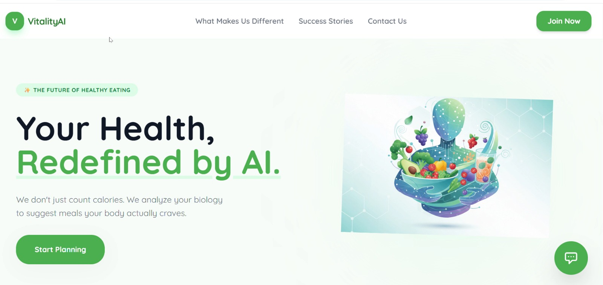
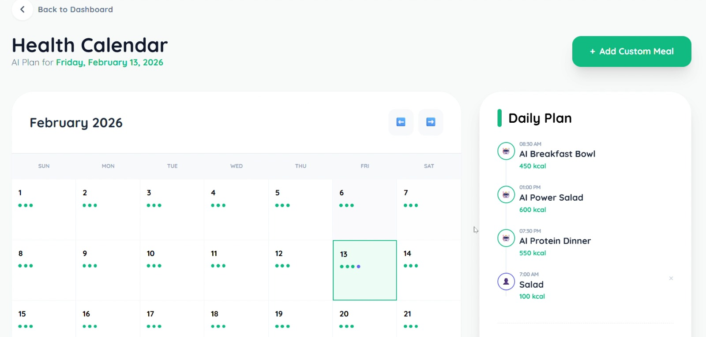
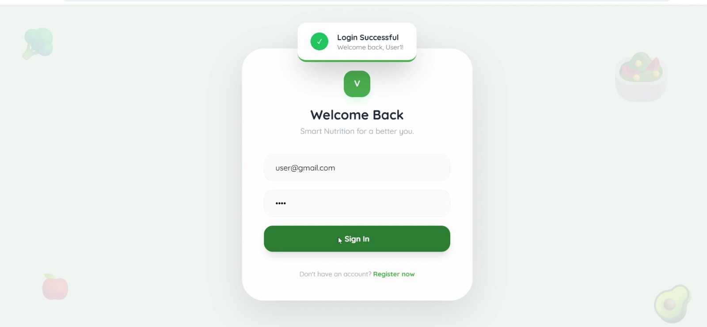

# 🥗 VitalityAI — AI-Powered Nutrition & Meal Planning

<div align="center">

### **Eat Smarter • Live Healthier • Powered by Artificial Intelligence**


<br>


</div>


#  Overview

**VitalityAI** is an AI-powered nutrition and meal planning web application that helps users make healthier dietary decisions through intelligent, personalized recommendations.

The platform enables users to input their dietary preferences, fitness objectives, allergies, and nutritional requirements, then instantly generates customized meal plans using the **Google Gemini 2.5 Flash** model. The application's objective is to transform complex nutritional planning into an intuitive and engaging experience while promoting healthier lifestyle choices.

Designed with a modern, responsive architecture, VitalityAI combines intelligent AI-powered recommendations with a visually immersive interface featuring custom glassmorphism components, a high-contrast dark theme, and dependency-free styling for maximum performance and accessibility.


# ✨ Features

-  **AI-Powered Meal Planning** – Generates personalized meal plans based on dietary preferences and health goals.
-  **Personalized Nutrition** – Tracks nutrition and provides tailored wellness recommendations.
-  **Gemini 2.5 Flash Integration** – Delivers real-time AI-generated meal suggestions and smart dietary insights.
-  **Modern Responsive UI** – Features a glassmorphism design, high-contrast dark theme, and seamless user experience across devices.

# 🛠 Tech Stack

##  Frontend

* HTML5
* CSS3
* JavaScript (ES6)
* AngularJS
* Custom Neat CSS
* Responsive Design
* Glassmorphism UI

---

##  Artificial Intelligence

* Google Gemini 2.5 Flash
* Prompt Engineering
* Real-Time AI Responses
* Personalized Recommendation Engine

---

##  APIs

* Gemini API
* RESTful API Communication
* JSON Data Exchange







#  Architecture

```text
VitalityAI
│
├── Frontend
│   ├── HTML5
│   ├── CSS3
│   ├── JavaScript
│   ├── AngularJS
│   └── Custom Neat CSS
│
├── AI Integration
│   ├── Gemini 2.5 Flash
│   ├── Prompt Processing
│   ├── Meal Generation
│   └── Nutrition Recommendation
│
└── API Communication
    ├── REST API
    └── JSON
```


#  Getting Started

## Prerequisites

* Modern Web Browser
* Internet Connection
* Gemini API Key

---

## Installation

Clone the repository.

```bash
git clone https://github.com/Sanika-Malwade-15/VitalityAI.git

cd VitalityAI
```

Configure your Gemini API key.

Run the application using your preferred local server.


#  Technology Summary

| Category      | Technologies                            |
| ------------- | --------------------------------------- |
| Frontend      | HTML5, CSS3, JavaScript, AngularJS      |
| AI            | Google Gemini 2.5 Flash                 |
| Communication | REST API                                |
| Data Format   | JSON                                    |
| Styling       | Custom Neat CSS                         |
| UI Design     | Glassmorphism, High-Contrast Dark Theme |
| Architecture  | Client-Side Web Application             |

---

# 👩‍💻 Author

**Sanika Mahesh Malwade**

Full Stack Developer • AI Enthusiast • Passionate about building intelligent, responsive, and user-centric web applications.

---

<div align="center">

### ⭐ If you found this project helpful, please consider giving it a Star!

**Built with ❤️ using HTML, CSS, JavaScript, AngularJS, and Google Gemini 2.5 Flash**

</div>
